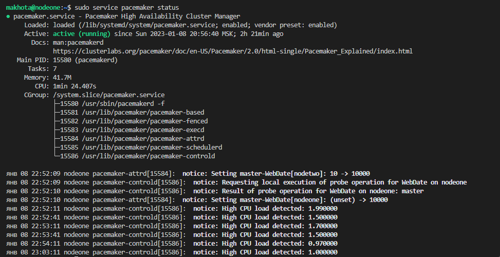

# Домашнее задание к занятию "10.3 Pacemaker" - `Елена Махота`

- [Ответ к Заданию 1](#1)
- [Ответ к Заданию 2](#2)
- [Ответ к Заданию 3](#3)
- [Ответ к Заданию 4*](#4)

---

### Задание 1.

Опишите основные функции и назначение Pacemaker.

*Приведите ответ в свободной форме.*

### *<a name="1">Ответ к Заданию 1</a>*

Peacemaker — это менеджер ресурсов кластера со следующими основными функциями:

● Обнаружение и восстановление сбоев на уровне узлов и сервисов;

● Независимость от подсистемы хранения: общий диск не требуется;

● Независимость от типов ресурсов: все, что может быть заскриптовано, может быть кластеризовано;

● Поддержка STONITH (Shoot-The-Other-Node-In-The-Head);

● Поддержка кластеров любого размера;

● Поддержка и кворумных и ресурсозависимых кластеров;

● Поддержка практически любой избыточной конфигурации;

● Автоматическая репликация конфига на все узлы кластера;

● Возможность задания порядка запуска ресурсов, а также их совместимости на одном узле;

● Поддержка расширенных типов ресурсов: клонов (запущен на множестве узлов) и с дополнительными состояниями 
(master/slave и т.п.);

● Единый кластерный шелл (crm), унифицированный, скриптующийся.


Использованные источники:

[Презентация "Отказоустойчивость:Pacemaker", АлександрЗубарев](https://u.netology.ru/backend/uploads/lms/attachments/files/data/27924/SRLB-9__Pacemaker.pdf)


---

### Задание 2.

Опишите основные функции и назначение Corosync.

*Приведите ответ в свободной форме.*


### *<a name="2">Ответ к Заданию 2</a>*

Corosync — программный продукт, позволяющий реализовать кластер серверов. Его основное назначение — знать и передавать состояние всех участников кластера.

В основе работы заложены следующие функции:

● отслеживание состояния приложений;

● оповещение приложений о смене активной ноды кластера;

● отправка одинаковых сообщений процессам на всех узлах кластера;

● предоставление доступа к базе данных с конфигурацией и статистикой, а также отправка уведомлений о ее изменениях.


Использованные источники:

[Презентация "Отказоустойчивость:Pacemaker", АлександрЗубарев](https://u.netology.ru/backend/uploads/lms/attachments/files/data/27924/SRLB-9__Pacemaker.pdf)


---

### Задание 3.

Соберите модель, состоящую из двух виртуальных машин. Установите pacemaker, corosync, pcs.  Настройте HA кластер.

*Пришлите конфигурации сервисов для каждой ноды, конфигурационный файл corosync и бэкап конфигурации pacemaker при помощи команды pcs config backup filename.*

### *<a name="3">Ответ к Заданию 3</a>*


Создала и настроила топологию


Установила pacemaker, corosync, pcs.  Настроила HA кластер, 
подробный порядок действий описан в файле [help.md](help.md)





[pcs_settings.conf](backup2/pcs_settings.conf)

```bash

{
  "format_version": 2,
  "data_version": 1,
  "clusters": [
    {
      "name": "MakhotaCluster",
      "nodes": [
        "nodeone",
        "nodetwo"
      ]
    }
  ],
  "permissions": {
    "local_cluster": [
      {
        "type": "group",
        "name": "haclient",
        "allow": [
          "grant",
          "read",
          "write"
        ]
      }
    ]
  }
}

```

[corosync.conf](backup2/corosync.conf)

```bash

totem {
    version: 2
    cluster_name: makhotaCluster
    transport: knet
    crypto_cipher: aes256
    crypto_hash: sha256
}

nodelist {
    node {
        ring0_addr: 192.168.0.101
        name: nodeone
        nodeid: 1
    }

    node {
        ring0_addr: 192.168.0.102
        name: nodetwo
        nodeid: 2
    }
}

quorum {
    provider: corosync_votequorum
    two_node: 1
}

logging {
    to_logfile: yes
    logfile: /var/log/corosync/corosync.log
    to_syslog: yes
    timestamp: on
}

```

[confbackup2](backup2)

[confbackup2.tar.bz2](backup2/confbackup2.tar.bz2)


---

### Дополнительные задания (со звездочкой*)
Эти задания дополнительные (не обязательные к выполнению) и никак не повлияют на получение вами зачета по этому домашнему заданию. Вы можете их выполнить, если хотите глубже и/или шире разобраться в материале.
 
---

### Задание 4.

Установите и настройте DRBD сервис для настроенного кластера.

*Пришлите  конфигурацию DRBD сервиса - *.res ресурсов для каждой ноды.**

### *<a name="4">Ответ к Заданию 4</a>*

Установила и настроила DRBD сервис для настроенного кластера.
Подробный порядок действий описан в файле [help.md](help.md)

конфигурацию DRBD сервиса - *.res ресурсов для каждой ноды.

[/etc/drbd.d/www.res](www.res)

```bash
resource www {
protocol C;
disk {
fencing resource-only;
}
handlers {
fence-peer
"/usr/lib/drbd/crm-fence-peer.sh";
after-resync-target
"/usr/lib/drbd/crm-unfence-peer.sh";
}
syncer {
rate 110M;
}
on nodetwo
{
device /dev/drbd1;
disk /dev/vg0/www;
address 192.168.56.120:7794;
meta-disk internal;
}
on nodeone
{
device /dev/drbd1;
disk /dev/vg0/www;
address 192.168.56.110:7794;
meta-disk internal;
}
}
```


[/etc/drbd.d/mysql.res](mysql.res)

```bash

resource mysql {
protocol C;

disk {
        fencing resource-only;
    }

handlers {
        fence-peer "/usr/lib/drbd/crm-fence-peer.sh";
        after-resync-target "/usr/lib/drbd/crm-unfence-peer.sh";
    }

syncer {
        rate 110M;
    }
on nodetwo
    {
        device /dev/drbd2;
        disk /dev/vg0/mysql;
        address 192.168.56.120:7795;
        meta-disk internal;
    }
on nodeone
    {
        device /dev/drbd2;
        disk /dev/vg0/mysql;
        address 192.168.56.110:7795;
        meta-disk internal;
    }
}

```


