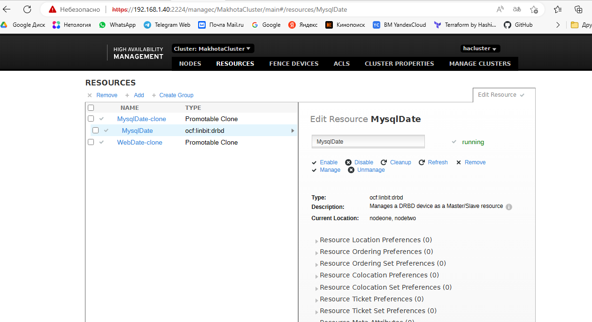
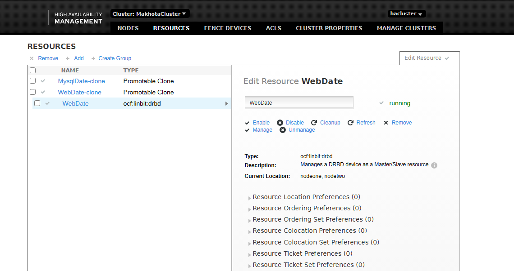

### Установка DRBD 
Distributed Replicated Block Device — «распределённое реплицируемое блочное устройство».

**Подготовка**

Делаем  для `nodeone` сетевые настройки  `/etc/network/interfaces`

```bash
auto lo
iface lo inet loopback

auto enp0s3
iface enp0s3 inet dhcp

auto enp0s8
iface enp0s8 inet static
address 192.168.0.101
netmask 255.255.255.0

auto enp0s9
iface enp0s9 inet static
address 192.168.56.110
netmask 255.255.255.0
```

Делаем  для `nodtwo` сетевые настройки  `/etc/network/interfaces`

```bash
auto lo
iface lo inet loopback

auto enp0s3
iface enp0s3 inet dhcp

auto enp0s8
iface enp0s8 inet static
address 192.168.0.102
netmask 255.255.255.0

auto enp0s9
iface enp0s9 inet static
address 192.168.56.120  
```


Корректируем `/etc/hosts`

```bash
127.0.0.1       localhost nodeone
127.0.1.1       nodeone
192.168.0.101   nodeone
192.168.0.102   nodetwo
192.168.56.110  nodeone
192.168.56.120  nodetwo
```

```bash
127.0.0.1       localhost nodetwo
127.0.1.1       nodetwo
192.168.0.101   nodeone
192.168.0.102   nodetwo
192.168.56.110  nodeone
192.168.56.120  nodetwo
```

Корректируем при необходимости `/etc/hostname`, указываем `nodeone` и `nodetwo` соответственно.

```bash
sudo reboot
```

В итоге получена топология:


**Устанавливаем DRBD на обе ноды**

```bash
sudo apt install drbd-utils
sudo modprobe drbd
echo “drbd” >> /etc/modules
```

**Настраиваем диски и разделы**

Проверяем имеющиеся накопители `lsblk`

```
NAME   MAJ:MIN RM  SIZE RO TYPE MOUNTPOINT
sda      8:0    0   20G  0 disk
├─sda1   8:1    0   19G  0 part /
├─sda2   8:2    0    1K  0 part
└─sda5   8:5    0  975M  0 part [SWAP]
sdb      8:16   0    4G  0 disk 
sr0     11:0    1 58,7M  0 rom
```

Создаем диск `primary` и логические разделы:

```bash
fdisk /dev/sdb
```

n — создание диска — либо primary, либо extension.
Создаем primary — ключ p.
Остальное по умолчанию.
Enter — Enter готово.


Ставим утилиту для работы с логическими разделами `apt-get install lvm2`

Создаем логические разделы:

```bash
pvcreate /dev/sdb1
vgcreate vg0 /dev/sdb1
lvcreate -L2G -n www vg0
lvcreate -L1G -n mysql vg0
```

Проверяем имеющиеся накопители `lsblk`

```

NAME          MAJ:MIN RM  SIZE RO TYPE MOUNTPOINT
sda             8:0    0   20G  0 disk
├─sda1          8:1    0   19G  0 part /
├─sda2          8:2    0    1K  0 part 
└─sda5          8:5    0  975M  0 part [SWAP]
sdb             8:16   0    4G  0 disk
└─sdb1          8:17   0    4G  0 part
  ├─vg0-www   254:0    0    2G  0 lvm
  └─vg0-mysql 254:1    0    1G  0 lvm
sr0            11:0    1 58,7M  0 rom

```

Создаем  конфигурационные файлы следующего содержания:

[/etc/drbd.d/www.res](www.res)

```bash
resource www {
protocol C;
disk {
fencing resource-only;
}
handlers {
fence-peer
"/usr/lib/drbd/crm-fence-peer.sh";
after-resync-target
"/usr/lib/drbd/crm-unfence-peer.sh";
}
syncer {
rate 110M;
}
on nodetwo
{
device /dev/drbd1;
disk /dev/vg0/www;
address 192.168.56.120:7794;
meta-disk internal;
}
on nodeone
{
device /dev/drbd1;
disk /dev/vg0/www;
address 192.168.56.110:7794;
meta-disk internal;
}
}
```


[/etc/drbd.d/mysql.res](mysql.res)

```bash

resource mysql {
protocol C;

disk {
        fencing resource-only;
    }

handlers {
        fence-peer "/usr/lib/drbd/crm-fence-peer.sh";
        after-resync-target "/usr/lib/drbd/crm-unfence-peer.sh";
    }

syncer {
        rate 110M;
    }
on nodetwo
    {
        device /dev/drbd2;
        disk /dev/vg0/mysql;
        address 192.168.56.120:7795;
        meta-disk internal;
    }
on nodeone
    {
        device /dev/drbd2;
        disk /dev/vg0/mysql;
        address 192.168.56.110:7795;
        meta-disk internal;
    }
}

```

После чего на обоих нодах выполняем:
```bash
drbdadm create-md www
drbdadm create-md mysql
drbdadm up all
```

На ноде `nodeone` выполняем:
```bash
drbdadm primary --force www
drbdadm primary --force mysql
```
На ноде `nodetwo` выполняем:
```bash
drbdadm secondary www
drbdadm secondary mysql
```

Запускаем сервис, проверяем синхронизацию:

```bash
sudo service drbd start
sudo service drbd status
sudo drbdadm start
sudo drbdadm status
```

Создаем разделы для монтирования на обеих нодах:
```bash
mkdir /mnt/www
mkdir /mnt/mysql
```

Монтируем раздел на мастер-ноде (`nodeone`)

```bash
mkfs.ext4 /dev/drbd1
mkfs.ext4 /dev/drbd2
mount /dev/drbd1 /mnt/www
mount /dev/drbd2 /mnt/mysql
```

Проверяем `lsblk`

```

NAME          MAJ:MIN RM    SIZE RO TYPE MOUNTPOINT
sda             8:0    0     20G  0 disk
├─sda1          8:1    0     19G  0 part /
├─sda2          8:2    0      1K  0 part
└─sda5          8:5    0    975M  0 part [SWAP]
sdb             8:16   0      4G  0 disk
└─sdb1          8:17   0      4G  0 part
  ├─vg0-www   254:0    0      2G  0 lvm  
  │ └─drbd1   147:1    0      2G  0 disk /mnt/www
  └─vg0-mysql 254:1    0      1G  0 lvm
    └─drbd2   147:2    0 1023,9M  0 disk /mnt/mysql
sr0            11:0    1   58,7M  0 rom

```

**Проверяем репликацию**

В папке `/mnt/www` создаем файл 

```bash
nano index.html
<html> <body>Hello, Welcome to main Debian High Availability Cluster</body></html>
```

Отмонтируем разделы на `nodeone`

```bash
umount /dev/drbd1
umount /dev/drbd2
```

Делаем ноду `nodeone` не мастером:
```bash
drbdadm secondary www
drbdadm secondary mysql
```

Делаем `nodetwo` масетером, монтируем разделы, проверяем наличие файла `index.html`

```bash
sudo drbdadm primary --force www
sudo drbdadm primary --force mysql
sudo drbdadm status
mount /dev/drbd1 /mnt/www
mount /dev/drbd2 /mnt/mysql
cat /mnt/www/index.html
```

Stdout:

`<html> <body>Hello, Welcome to main Debian High Availability Cluster</body></html>`

Отмонтируем разделы на `nodetwo`, возвращаем мастера, монтируем разделы на `nodeone`

**Установка  pacemaker, corosync, pcs**

Ставим на обе ноды

```bash
sudo apt install pacemaker corosync pcs
systemctl enable pcsd 
```

При установке pacemaker автоматически будет создан пользователь `hacluster`. Для использования `pcs`, а также для 
доступа в веб-интерфейс, нужно задать пароль пользователю `hacluster` на обеих нодах:
```bash
passwd hacluster
```

Стартуем службы и проверяем статус:

```bash
sudo systemctl start pcsd
sudo systemctl start corosync
sudo systemctl start pacemaker
sudo systemctl status pcsd
sudo systemctl status corosync
sudo systemctl status pacemaker
```

Настраиваем аутентификацию (на одном узле):
```bash
pcs host auth nodeone nodetwo
Username: hacluster
Password:
```

Авторизуемся в web `https://192.168.1.40:2224/` `Username: hacluster Password:`


**Запускаем кластер**

```bash
pcs cluster setup MakhotaCluster nodeone nodetwo 
```

Stdout:

```
Warning: Unable to read the known-hosts file: No such file or directory: '/var/lib/pcsd/known-hosts'
Error: Hosts 'nodeone', 'nodetwo' are not known to pcs, try to authenticate the hosts using 'pcs host auth nodeone nodetwo' command  
```

Fix:

```
pcs cluster destroy
pcs host auth nodeone nodetwo
pcs cluster setup MakhotaCluster nodeone nodetwo 
```

Stdout:
```
Cluster has been successfully set up.
```

Следующим шагом устанавливаем активными все ноды:
```bash
pcs cluster enable --all 
```

Проверка:

```bash
sudo pcs status
```

Stdout:
```
Node List:
  * Node nodeone: UNCLEAN (offline)
  * Node nodetwo: UNCLEAN (offline)
```

Добавляем ip-адреса в файл [/etc/corosync/corosync.conf](corosync.conf)

Перезапускаем сервисы:
```bash
sudo systemctl restart pcsd
sudo systemctl restart corosync
sudo systemctl restart pacemaker
```

Проверка:

```bash
sudo pcs status
```

Stdout:
```
Cluster name: MakhotaCluster

WARNINGS:
No stonith devices and stonith-enabled is not false

Cluster Summary:
  * Stack: corosync
  * Current DC: nodeone (version 2.0.5-ba59be7122) - partition with quorum
  * Last updated: Sun Jan  8 20:57:37 2023
  * Last change:  Sun Jan  8 20:56:39 2023 by hacluster via crmd on nodeone
  * 2 nodes configured
  * 0 resource instances configured

Node List:
  * Online: [ nodeone nodetwo ]

Full List of Resources:
  * No resources

Daemon Status:
  corosync: active/enabled
  pacemaker: active/enabled
  pcsd: active/enabled

```

Добавляем ноды на мониторинг в web


**Добавление ресурсов**

Добавляем apache2


Создадим виртуальный ip для heartbeat:
```bash
pcs resource create virtual_ip ocf:heartbeat:IPaddr2 ip=192.168.0.10 cidr_netmask=24 op monitor interval=60s
```
Добавим ресурсы drbd:
```bash
pcs -f drbd_cfg resource create WebDate ocf:linbit:drbd drbd_resource=www op monitor interval=60s
pcs -f drbd_cfg resource create MysqlDate ocf:linbit:drbd drbd_resource=mysql op monitor interval=60s
```

Вводим кластер второй и репликацию: 
```bash
pcs -f drbd_cfg resource promotable WebDate promoted-max=1 promoted-node-max=1 clone-max=2 clone-node-max=1 notify=true
pcs -f drbd_cfg resource promotable MysqlDate promoted-max=1 promoted-node-max=1 clone-max=2 clone-node-max=1 notify=true
```

Проверка и  обновление конфигурации 
```bash
sudo pcs -f drbd_cfg resource
sudo pcs cluster cib-push drbd_cfg --config
sudo pcs property set stonith-enabled=false
sudo pcs cluster cib
```

Stdout:

```
<cib crm_feature_set="3.6.1" validate-with="pacemaker-3.5" epoch="26" num_updates="10" admin_epoch="0" cib-last-written="Sun Jan  8 22:51:22 2023" update-origin="nodeone" update-client="crmd" update-user="hacluster" have-quorum="1" dc-uuid="2">
  <configuration>
    <crm_config>
      <cluster_property_set id="cib-bootstrap-options">
        <nvpair id="cib-bootstrap-options-have-watchdog" name="have-watchdog" value="false"/>
        <nvpair id="cib-bootstrap-options-dc-version" name="dc-version" value="2.0.5-ba59be7122"/>
        <nvpair id="cib-bootstrap-options-cluster-infrastructure" name="cluster-infrastructure" value="corosync"/>
        <nvpair id="cib-bootstrap-options-cluster-name" name="cluster-name" value="MakhotaCluster"/>
        <nvpair id="cib-bootstrap-options-stonith-enabled" name="stonith-enabled" value="false"/>
        <nvpair id="cib-bootstrap-options-last-lrm-refresh" name="last-lrm-refresh" value="1673207482"/>
      </cluster_property_set>
    </crm_config>
    <nodes>
      <node id="2" uname="nodetwo"/>
      <node id="1" uname="nodeone"/>
    </nodes>
    <resources>
      <clone id="WebDate-clone">
        <primitive id="WebDate" class="ocf" type="drbd" provider="linbit">
          <instance_attributes id="WebDate-instance_attributes">
            <nvpair id="WebDate-instance_attributes-drbd_resource" name="drbd_resource" value="www"/>
            <nvpair id="WebDate-instance_attributes-drbdconf" name="drbdconf" value="/etc/drbd.d/www.res"/>
          </instance_attributes>
          <operations>
            <op name="demote" timeout="90" interval="0s" id="WebDate-demote-interval-0s"/>
            <op name="monitor" interval="60s" id="WebDate-monitor-interval-60s"/>
            <op name="notify" timeout="90" interval="0s" id="WebDate-notify-interval-0s"/>
            <op name="promote" timeout="90" interval="0s" id="WebDate-promote-interval-0s"/>
            <op name="reload" timeout="30" interval="0s" id="WebDate-reload-interval-0s"/>
            <op name="start" timeout="240" interval="0s" id="WebDate-start-interval-0s"/>
            <op name="stop" timeout="100" interval="0s" id="WebDate-stop-interval-0s"/>
          </operations>
        </primitive>
        <meta_attributes id="WebDate-clone-meta_attributes">
          <nvpair id="WebDate-clone-meta_attributes-clone-max" name="clone-max" value="2"/>
          <nvpair id="WebDate-clone-meta_attributes-clone-node-max" name="clone-node-max" value="1"/>
          <nvpair id="WebDate-clone-meta_attributes-notify" name="notify" value="true"/>
          <nvpair id="WebDate-clone-meta_attributes-promotable" name="promotable" value="true"/>
          <nvpair id="WebDate-clone-meta_attributes-promoted-max" name="promoted-max" value="1"/>
          <nvpair id="WebDate-clone-meta_attributes-promoted-node-max" name="promoted-node-max" value="1"/>
        </meta_attributes>
      </clone>
      <clone id="MysqlDate-clone">
        <primitive id="MysqlDate" class="ocf" type="drbd" provider="linbit">
          <instance_attributes id="MysqlDate-instance_attributes">
            <nvpair id="MysqlDate-instance_attributes-drbd_resource" name="drbd_resource" value="mysql"/>
            <nvpair id="MysqlDate-instance_attributes-drbdconf" name="drbdconf" value="/etc/drbd.d/mysql.res"/>
          </instance_attributes>
          <operations>
            <op name="demote" timeout="90" interval="0s" id="MysqlDate-demote-interval-0s"/>
            <op name="monitor" interval="60s" id="MysqlDate-monitor-interval-60s"/>
            <op name="notify" timeout="90" interval="0s" id="MysqlDate-notify-interval-0s"/>
            <op name="promote" timeout="90" interval="0s" id="MysqlDate-promote-interval-0s"/>
            <op name="reload" timeout="30" interval="0s" id="MysqlDate-reload-interval-0s"/>
            <op name="start" timeout="240" interval="0s" id="MysqlDate-start-interval-0s"/>
            <op name="stop" timeout="100" interval="0s" id="MysqlDate-stop-interval-0s"/>
          </operations>
        </primitive>
        <meta_attributes id="MysqlDate-clone-meta_attributes">
          <nvpair id="MysqlDate-clone-meta_attributes-clone-max" name="clone-max" value="2"/>
          <nvpair id="MysqlDate-clone-meta_attributes-clone-node-max" name="clone-node-max" value="1"/>
          <nvpair id="MysqlDate-clone-meta_attributes-notify" name="notify" value="true"/>
          <nvpair id="MysqlDate-clone-meta_attributes-promotable" name="promotable" value="true"/>
          <nvpair id="MysqlDate-clone-meta_attributes-promoted-max" name="promoted-max" value="1"/>
          <nvpair id="MysqlDate-clone-meta_attributes-promoted-node-max" name="promoted-node-max" value="1"/>
        </meta_attributes>
      </clone>
    </resources>
    <constraints/>
  </configuration>
  <status>
    <node_state id="1" uname="nodeone" in_ccm="true" crmd="online" crm-debug-origin="do_update_resource" join="member" expected="member">
      <transient_attributes id="1">
        <instance_attributes id="status-1">
          <nvpair id="status-1-master-MysqlDate" name="master-MysqlDate" value="10000"/>
          <nvpair id="status-1-master-WebDate" name="master-WebDate" value="10000"/>
        </instance_attributes>
      </transient_attributes>
      <lrm id="1">
        <lrm_resources>
          <lrm_resource id="MysqlDate" type="drbd" class="ocf" provider="linbit">
            <lrm_rsc_op id="MysqlDate_last_0" operation_key="MysqlDate_monitor_0" operation="monitor" crm-debug-origin="do_update_resource" crm_feature_set="3.6.1" transition-key="2:48:7:9a173434-0cd7-4de0-b595-1adfc5e296b2" transition-magic="0:8;2:48:7:9a173434-0cd7-4de0-b595-1adfc5e296b2" exit-reason="" on_node="nodeone" call-id="60" rc-code="8" op-status="0" interval="0" last-rc-change="1673207344" 
last-run="1673207344" exec-time="192" queue-time="0" op-digest="d389b747f0f1f048d98c0a60e9a48a0d" op-force-restart="  drbd_resource  " 
op-restart-digest="cda1836a05a8188b9dfd7ded69520b15"/>
            <lrm_rsc_op id="MysqlDate_last_failure_0" operation_key="MysqlDate_monitor_0" operation="monitor" crm-debug-origin="do_update_resource" crm_feature_set="3.6.1" transition-key="2:48:7:9a173434-0cd7-4de0-b595-1adfc5e296b2" transition-magic="0:8;2:48:7:9a173434-0cd7-4de0-b595-1adfc5e296b2" exit-reason="" on_node="nodeone" call-id="60" rc-code="8" op-status="0" interval="0" last-rc-change="1673207344" last-run="1673207344" exec-time="192" queue-time="0" op-digest="d389b747f0f1f048d98c0a60e9a48a0d"/>
          </lrm_resource>
          <lrm_resource id="WebDate" type="drbd" class="ocf" provider="linbit">
            <lrm_rsc_op id="WebDate_last_0" operation_key="WebDate_monitor_0" operation="monitor" crm-debug-origin="do_update_resource" crm_feature_set="3.6.1" transition-key="2:56:7:9a173434-0cd7-4de0-b595-1adfc5e296b2" transition-magic="0:8;2:56:7:9a173434-0cd7-4de0-b595-1adfc5e296b2" exit-reason="" on_node="nodeone" call-id="70" rc-code="8" op-status="0" interval="0" last-rc-change="1673207529" last-run="1673207529" exec-time="436" queue-time="0" op-digest="cfb041d5e43c0e840cf503b05d51fd32" op-force-restart="  drbd_resource  " op-restart-digest="bb8c721b01e076b009833f71722c1975"/>
            <lrm_rsc_op id="WebDate_last_failure_0" operation_key="WebDate_monitor_0" operation="monitor" crm-debug-origin="do_update_resource" crm_feature_set="3.6.1" transition-key="2:56:7:9a173434-0cd7-4de0-b595-1adfc5e296b2" transition-magic="0:8;2:56:7:9a173434-0cd7-4de0-b595-1adfc5e296b2" exit-reason="" on_node="nodeone" call-id="70" rc-code="8" op-status="0" interval="0" last-rc-change="1673207529" last-run="1673207529" exec-time="436" queue-time="0" op-digest="cfb041d5e43c0e840cf503b05d51fd32"/>
          </lrm_resource>
        </lrm_resources>
      </lrm>
    </node_state>
    <node_state id="2" uname="nodetwo" crmd="online" crm-debug-origin="do_update_resource" in_ccm="true" join="member" expected="member">
      <transient_attributes id="2">
        <instance_attributes id="status-2">
          <nvpair id="status-2-master-MysqlDate" name="master-MysqlDate" value="10000"/>
          <nvpair id="status-2-master-WebDate" name="master-WebDate" value="10000"/>
          <nvpair id="status-2-fail-count-WebDate.promote_0" name="fail-count-WebDate#promote_0" value="1"/>
          <nvpair id="status-2-last-failure-WebDate.promote_0" name="last-failure-WebDate#promote_0" value="1673207529"/>
        </instance_attributes>
      </transient_attributes>
      <lrm id="2">
        <lrm_resources>
          <lrm_resource id="MysqlDate" type="drbd" class="ocf" provider="linbit">
            <lrm_rsc_op id="MysqlDate_last_0" operation_key="MysqlDate_monitor_0" operation="monitor" crm-debug-origin="do_update_resource" crm_feature_set="3.6.1" transition-key="2:49:7:9a173434-0cd7-4de0-b595-1adfc5e296b2" transition-magic="0:0;2:49:7:9a173434-0cd7-4de0-b595-1adfc5e296b2" exit-reason="" on_node="nodetwo" call-id="57" rc-code="0" op-status="0" interval="0" last-rc-change="1673207344" 
last-run="1673207344" exec-time="156" queue-time="0" op-digest="d389b747f0f1f048d98c0a60e9a48a0d" op-force-restart="  drbd_resource  " 
op-restart-digest="cda1836a05a8188b9dfd7ded69520b15"/>
            <lrm_rsc_op id="MysqlDate_last_failure_0" operation_key="MysqlDate_monitor_0" operation="monitor" crm-debug-origin="do_update_resource" crm_feature_set="3.6.1" transition-key="2:49:7:9a173434-0cd7-4de0-b595-1adfc5e296b2" transition-magic="0:0;2:49:7:9a173434-0cd7-4de0-b595-1adfc5e296b2" exit-reason="" on_node="nodetwo" call-id="57" rc-code="0" op-status="0" interval="0" last-rc-change="1673207344" last-run="1673207344" exec-time="156" queue-time="0" op-digest="d389b747f0f1f048d98c0a60e9a48a0d"/>
            <lrm_rsc_op id="MysqlDate_monitor_60000" operation_key="MysqlDate_monitor_60000" operation="monitor" crm-debug-origin="do_update_resource" crm_feature_set="3.6.1" transition-key="34:50:0:9a173434-0cd7-4de0-b595-1adfc5e296b2" transition-magic="0:0;34:50:0:9a173434-0cd7-4de0-b595-1adfc5e296b2" exit-reason="" on_node="nodetwo" call-id="58" rc-code="0" op-status="0" interval="60000" last-rc-change="1673207345" exec-time="169" queue-time="0" op-digest="f90bd3e8802df7ac5d4bb28d39c432eb"/>
          </lrm_resource>
          <lrm_resource id="WebDate" type="drbd" class="ocf" provider="linbit">
            <lrm_rsc_op id="WebDate_last_0" operation_key="WebDate_monitor_0" operation="monitor" crm-debug-origin="do_update_resource" crm_feature_set="3.6.1" transition-key="3:55:7:9a173434-0cd7-4de0-b595-1adfc5e296b2" transition-magic="0:0;3:55:7:9a173434-0cd7-4de0-b595-1adfc5e296b2" exit-reason="" on_node="nodetwo" call-id="84" rc-code="0" op-status="0" interval="0" last-rc-change="1673207529" last-run="1673207529" exec-time="172" queue-time="0" op-digest="cfb041d5e43c0e840cf503b05d51fd32" op-force-restart="  drbd_resource  " op-restart-digest="bb8c721b01e076b009833f71722c1975"/>
            <lrm_rsc_op id="WebDate_last_failure_0" operation_key="WebDate_monitor_0" operation="monitor" crm-debug-origin="do_update_resource" crm_feature_set="3.6.1" transition-key="3:55:7:9a173434-0cd7-4de0-b595-1adfc5e296b2" transition-magic="0:0;3:55:7:9a173434-0cd7-4de0-b595-1adfc5e296b2" exit-reason="" on_node="nodetwo" call-id="84" rc-code="0" op-status="0" interval="0" last-rc-change="1673207529" last-run="1673207529" exec-time="172" queue-time="0" op-digest="cfb041d5e43c0e840cf503b05d51fd32"/>
            <lrm_rsc_op id="WebDate_monitor_60000" operation_key="WebDate_monitor_60000" operation="monitor" crm-debug-origin="do_update_resource" crm_feature_set="3.6.1" transition-key="8:58:0:9a173434-0cd7-4de0-b595-1adfc5e296b2" transition-magic="0:0;8:58:0:9a173434-0cd7-4de0-b595-1adfc5e296b2" exit-reason="" on_node="nodetwo" call-id="85" rc-code="0" op-status="0" interval="60000" last-rc-change="1673207530" exec-time="214" queue-time="0" op-digest="340be6070994d46f7a40ade4658dc018"/>
          </lrm_resource>
        </lrm_resources>
      </lrm>
    </node_state>
  </status>
</cib>
```


Stdout `sudo pcs status`

```
Cluster name: MakhotaCluster
Cluster Summary:
  * Stack: corosync
  * Current DC: nodetwo (version 2.0.5-ba59be7122) - partition with quorum
  * Last updated: Sun Jan  8 23:00:15 2023
  * Last change:  Sun Jan  8 22:51:22 2023 by hacluster via crmd on nodeone
  * 2 nodes configured
  * 4 resource instances configured

Node List:
  * Online: [ nodeone nodetwo ]

Full List of Resources:
  * Clone Set: WebDate-clone [WebDate] (promotable):
    * Masters: [ nodeone ]
    * Slaves: [ nodetwo ]
  * Clone Set: MysqlDate-clone [MysqlDate] (promotable):
    * Masters: [ nodeone ]
    * Slaves: [ nodetwo ]

Daemon Status:
  corosync: active/enabled
  pacemaker: active/enabled
  pcsd: active/enabled

```

Смотрим web





Делаем резервную копию конфигурации

```bash
pcs config backup confbackup2

```

Смотрим что в архиве, разархивируем

```bash
sudo tar -x -j -f confbackup2.tar.bz2
```

[confbackup2](backup2)

[confbackup2.tar.bz2](backup2/confbackup2.tar.bz2)

